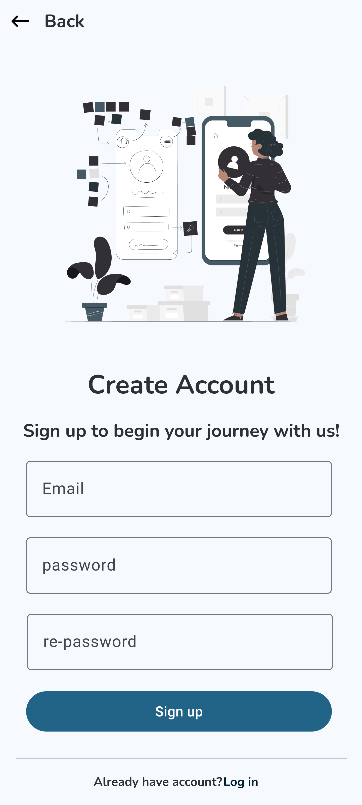

# 🎓 Attendo - AI-Based Attendance Management Android App

Imagine a world where taking attendance is seamless, secure, and smart. Attendo transforms how classrooms operate by integrating cutting-edge deep learning technology for face recognition and location verification. 

Attendo is a high-security attendance system that uses a 3-step verification process—Location, Facial Recognition, and Class Codes—to eliminate attendance fraud and automate classroom management.

---

## 📱 App Preview
*Reference visuals from the project brochure to see the interface in action .*

| **User Login & Entry** | **Teacher Dashboard** | **Verification Process** |
| :--- | :--- | :--- |
|   | | |
| User-friendly role selection for Teachers and Students. | Comprehensive view of classrooms and live attendance stats. | Real-time map tracking and facial scanning interface. |

---

## 🛠️ Technology Stack
The architecture of Attendo is designed for real-time performance and high security.

### Core Infrastructure
*   **Frontend:** **XML** for building responsive and intuitive user interfaces.
*   **Backend:** **Kotlin**, providing a modern, safe, and efficient environment for Android logic.
*   **Database:** **Firebase**, used for real-time data synchronization of attendance records and secure user authentication.
*   **Artificial Intelligence:** **Python**, powering the deep learning models used for facial recognition and verification.

### Verification Logic
To ensure accuracy, the app utilizes a unique 3-step protocol:
1.  **Geofencing:** Verifies the student is within the teacher's physical radius using GPS.
2.  **Biometrics:** Uses AI-driven face verification to ensure the correct student is present.
3.  **Dynamic Codes:** Requires a secret class code generated by the teacher for final confirmation.

---

## ⚙️ Functionality

### 👨‍🏫 For Teachers
*   **Virtual Classrooms:** Set up classrooms by college, semester, year, and branch.
*   **Live Class Control:** Specify class names, current location, and unique access codes.
*   **Administrative Oversight:** Full control to add or remove students and mark manual attendance if necessary.
*   **Data-Driven Insights:** View individual attendance percentages and total class presence instantly.

### 👨‍🎓 For Students
*   **Secure Enrollment:** Sign up with profile details and an initial face scan for future recognition.
*   **Attendance Tracking:** Review records for past classes and monitor your overall attendance percentage.
*   **Seamless Check-in:** Join live classes and complete the 3-step verification in seconds .

---

## 🚀 Why Attendo?
*   **Accuracy and Reliability:** Eliminates errors and ensures consistent record-keeping.
*   **Enhanced Security:** Prevents attendance fraud through 3-step verification and secures data.
*   **Time Efficiency:** Speeds up attendance taking, freeing up class time.
*   **Real-Time Insights:** Provides instant tracking for teachers and awareness for students.

